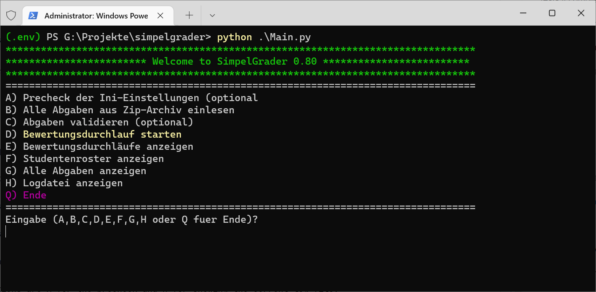
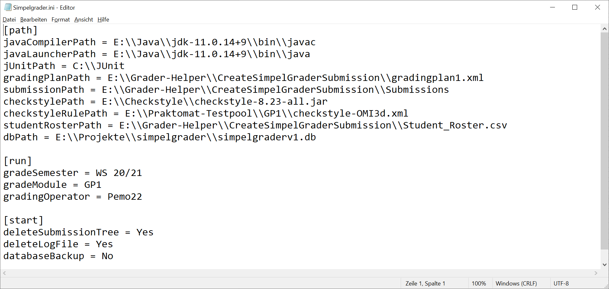

05/05/22

# simpelgrader (version 0.8)
A simple Python application for grading Java assignments by running defined actions and tests for each submission

## about the programm
I started the development of Simpelgrader in March 2022 as part of my bachelor thesis about auto grading programming assignments because I felt there is a need for such a tool.

Wait, another autograder? Aren't there already a couple dozens (or maybe several hundreds) available for more than at least a decade? Why another one? And why as an old fashioned Python console application? And no GPT3 (Open AI)?

My thoughts were exactly the same;) - I definitely did not want to add another auto grader to the menue list. There are very good and well established applications like Praktomat, Graja, GATE, JACK and others and there are Moodle plugins like Coderunner or VirtualProgrammingLab which are all very good.

But I saw couple of short comings:

- Many applications are complex
- Some graders offer too many functions
- Not every autograder api is very well documented
- Some autograders are old (which is not automatically bad of course)
- Not very autograder is an Open Source project on GitHub, GitLab etc
- Not every institution uses Moodle
- And: When autograding a lot of assignments everything may start with a huge zip file

With *Simpelgrader* I'll try to address a few of these shortcommings:

- Processing a single zip file that contains all the assignments
- A small project that should be easy to understand
- Hopefully the whole source code is documented
- I will try to improve the application in the near future

But most important: *Simpelgrader* is **not** a complete autograder. Its more an assistent for a teacher that should make grading a lot of submission less time consuming. 

It runs prefined actions and tests associated with each submission file through a xml file.

At the moment there is only a basic feedback mechanismen and there are no means to adapt the weighting of points for each action and test.

And *Simpelgrader* only works with simple Java assignments where the task always is to write a console application that does certain things and outputs something.

But again, *Simpelgrader* is **not** a full automatic autograder.

So, what is *Simpelgrader* good for?

As I already have stated, at the moment *Simpelgrader* is for teachers or assistants of teachers of Java programming classes whose task is it to grade programming assigments that had been uploaded in a Moodle course as zip files.

*Simpelgrader* will process the single zip downloaded from *Moodle*, extract its content into directories, checks for completeness, stores everything in a small database and process each submission by running predefined actions like Java compile, a Checkstyle test or a JUnit test.

The result of each action/test will be stored in the database and displayed as an HTML report in the browser.

### Moodle only?
*Simpelgrader* has, of course, no depencency on *Moodle*. The only connection to *Moodle* is the fact that all submitted zip files have to be part of another zip file (*Submission_1_EA1_First_Last.zip*)
for example.

The idea is that *Simpelgrader* will hopefully save a lot of time because each zip file does not need to be extracted and each Java file does not have to load into Eclipse just to check if it compiles and to run Checkstyle.

The assistant/teacher still has to look at the source code, may be rerun tests, run additional tests and have to do the grading and write a feedback for the student.

But since the boring and error prone tasks are already done, there should be more time and energy left for the important parts:

- To really look at the solution
- May be check for plagiarism
- Write a formative feedback

*Simpelgrader* is easy to install. I developed the application on Windows but it should run with no problemo on Linux and MacOS.

Python 3.8 is a requirement because I wanted to use a nice improvements for while loops.

*Simpelgrader* cannot run out of the box because two things have to be prepared first:

1. the grading xml file
2. the settings in *simpelgrader.ini*
3. Some Python packages (like lxml) have to be installed first (there is a *requirements.txt* of course)

Preparing the xml file can be a little time consuming because it means to define for each exercise a name, the name of the needed files, and additional actions and tests if compile and checkstyle is not enough.

The sample grade xml file *gradingplan1.xml* in the *sampledata* directory is a template for a customized grading plan.

Step 2 is about writing the path of some directories and the name of the semester and the module in the ini file.

If everything is setup, *Simpelgrader* runs as any Python console application. A grade run will take a couple of minutes and ends always with showing a couple of report files.

## getting started with the project and run Simpelgrader

First clone the repository into an subdirectory of the current directory 

`git clone https://github.com/pemo11/simpelgrader`

Create a Python virtual enviroment (not necessary but recommended)

`python -m venv .env`

Activate the virtual environment

`.env/scripts/activate`

Install the (few) requirements.

`pip -r requirements.txt`

In *PyCharm*, its necessary to choose either the Python interpreter from the newly created environment or choose any other Python 3.8 or above interpreter.

Altough it is not possible to start a grading without setting up the ini file that contains all the neccessary pathes, *Simpelgrader* will start without any errors.

After the start the application menue is shown.



The only possible options without editing *Simpelgrader.ini* are **A** for the precheck and **H** for showing the current log file.

And, if available, **I** for setting up the *Simpelgrader.ini* file.

I am preparing a simple setup assistant but right now the ini file must bei edited with an editor.

### editing Simpelgrader.ini

Editing *Simpelgrader.ini* means providing the pathes for the several directories that *Simpelgrader* uses.

Currently they are 9 different pathes that have to be set. Table 1 shows each setting with an explanation and an example.



Setting| Path of...                                      |Sample value
---|-------------------------------------------------|---
javaCompilerPath| the java compiler program file                  |E:\\Java\\jdk-11.0.14+9\\bin\\javac
javaLauncherPath | the java launcher program file                  |E:\\Java\\jdk-11.0.14+9\\bin\\java
jUnitPath| the two JUnit 4.x jar files                     |C:\\JUnit
gradingPlanPath| the xml file with the grading plan              |E:\\Grader-Helper\\CreateSimpelGraderSubmission\\gradingplan1.xml
submissionPath| the zip file that contains the submissions      |E:\\Grader-Helper\\CreateSimpelGraderSubmission\\Submissions
checkstylePath| the directory with the checkstyle jar file      |E:\\Checkstyle\\checkstyle-8.23-all.jar
checkstyleRulePath| the path of the checkstyle rule file            |E:\\Praktomat-Testpool\\GP1\\checkstyle-OMI3d.xml
studentRosterPath| the path of the csv file with the student names |E:\\Grader-Helper\\CreateSimpelGraderSubmission\\Student_Roster.csv
dbPath| the path of the sqlite db database file         |E:\\Projekte\\simpelgrader\\simpelgraderv1.db
*Table 1: Path settings in Simpelgrader.ini*

Table 2 contain the other settings whose values are all optional.

section|setting|meaning
---|---|---
run|gradeSemester|Name of the semester (just for the report)
run|gradeModule|Name of the module (just for the report)
run|gradingOperator|Name of the user (just of the report)
start|deleteSubmissionTree|Yes = delete all already extracted zip files first
start|deleteLogFile|Yes = start with a new log file each time
start|databaseBackup|make a copy of the db file before quitting the program
*Table 2: General settings in Simpelgrader.ini*

### editing the grading plan

The grading plan is a simple xml file that contains a *task* element for each exercise:

```
<sig:tasks xmlns:sig="urn:simpelgrader">
  <sig:task id="1000" exercise="EA1" title="Aufgabe EA1">
    <sig:description>description for task 1000</sig:description>
    <sig:files>
      <sig:file>App.java</sig:file>
      <sig:file>AppTest.java</sig:file>
    </sig:files>
    <sig:actions>
      <sig:action id="A01" active="True" type="java-compile">compile java file</sig:action>
    </sig:actions>
    <sig:tests>
      <sig:test id="T01" active="True">
        <sig:test-type>checkstyle</sig:test-type>
        <sig:test-description>Checkstyle-Überprüfung mit Omi-Regeln</sig:test-description>
        <sig:test-driver></sig:test-driver>
        <sig:test-score>1</sig:test-score>
      </sig:test>
    </sig:tests>
  </sig:task>
  ...

</tasks>
```

Each *task* element contains an *files*, *actions* and a *tests* subelement. The **actions** element contains one or more *action* element, the **tests** element contains therefore several *test* elements.

At the moment, there is only a single action possible, the compile action that compiles the Java file.

List of actions
- compile

At the moment, there are three different testing methods. Therefore the *tests* element will always contain several *test* elements. More on this later.

List of tests
- checkstyle
- junit
- textcompare

The type names in the xml file are **not** case sensitive.

There is a naming convention for the java files:

1. **If the name ends with "Test" (like AppTest.java) the file will be threated as a JUnit file**

2. **If the name ends with "Tester" (like AppTester.java) the file will be threated as a "test driver" application for text comparison"**

Each action or test can be active or not. If a action or test is not active it will be omitted during a grading run.

I hope that this does not sound too confusing. There is a sample xml file in the sample directory. The only thing that needs to change are the name of exercises because this names have to be part of the file name for every submission.

**Example**: the name of an exercise is EA1. This means that each submitted zip file has to follow the simple naming scheme:

*EA1_FirstName_LastName.zip*

Withouth a task-element with exercise="EA1" *Simpelgrader* would not process this submission.

## working with simpelgrader (part 1)

The following instructions assumes that the zip file with the submissions had been downloaded from Moodle.

When everything (*gradingplan.xml* and *simpelgrader.ini*) are setup up, working with *Simpelgrader* is really simple.

### Step 1: Create the single submission zip

This step is usually not necessary because the zip file will be downloaded from the Moodle course.

At the moment *Simpelgrader* assumes that the structure of the zip file is the same as zip file downloaded from *Moodle*. But that does not mean *Simpelgrader* cannot used without *Moodle*.

It only means that all submissions have to put together in one big file.

*Examle*: The submission for exercise EA1 by student Fred Meyer consists of two files: *App.java* and *AppTest.java*.

The first step is to zip the two files into an archive with the name *EA1_Fred_Meyer.zip*.

The second step is to zip the zip file into another zip file whose name starts with *Submission_* and a unique number, eg. *Submission_1_EA1_Fred_Meyer.zip*.

In the third step this zip file is again zipped with all the other submission zip files into one single zip file.

This single zip file is the (only) file in the submission directory.

### Step 2: Check the Settings (Menue A)

This step is optional. It validates if every path in *Simpelgrader.ini* really exists.

### Step 3: Read the archive (Menue B)

This step is mandatory. The submission zip file will be expanded to the temp directory, like *%appdata%\simpelgrader* under Windows.

** The path for Linux and MacOS has not determined yet**
```
simpelgrader
--semestername
----modulename
```

Each submission will be copied into its own sub directory with the name schema *Exercisename_StudentName*.


### Step 4: Validates the submission (Menue C)

This step is optional again. It validates each submission subdirectory by comparing the files in that directory with the files from the grading xml for that exercise.

The result is a html report that will be automatically shown in the browser.

### Step 5: Start a grading run (Menue D)

This step is mandatory. All the files in each submission directory will be "graded" which only means that each active action and each test for that exercise will be applied to each file.

The result is another html report that will be automatically shown in the browser.

### Step 6: Display all grading runs (Menue E)

A list of all grading runs without many details yet. 

### Step 7: Display the student roster (Menue F)

A list of all student that are on the roster list. This is just for validating that the list of students is complete.

### Step 8: Display all submissions (Menue G)

A list of all submissions. Again, not very many details yet. If all files are complete, the output is green, otherwise yellow.

### Step 9: Display the current log file (Menue H)

Another way to display the latestet log file. A line that starts with *** means information, ### means an "error" during validation and !!! means a program error and is something to thing about or better, make an issue in the repo out of it.

### Step 10: Setup Simpelgrader.ini (Menue H)

This step should be step 1 - at the moment its for testing purpose only.

## working with Simpelgrader (part 2)

In this part I will explain how to start as a teacher with the first assigments.

Lets assume there is a single assignment for a Java introductionary course:

*Write a class that contains a single method **SchaltjahrTest** that tests if a given year is a leap year. The method shall accept a int value as the only parameter and returns a boolean (true if the year is a leap year, otherwise false).*

A solution file App.java would like this:

```
/**
 * Schaltjahrberechnung
 * @author <author>, Matrikel-Nr: <Matr-Nr>
 */
public class App {

     /**
     * Gibt an, ob ein Jahr ein Schaltjahr ist
     * @param jahr
     * @return
     */
    public static boolean schaltjahrTest(int jahr) {
        return jahr % 4 == 0 && (jahr % 400 == 0 || jahr % 100 != 0);
    }
}
```
The *@author* comment is important and therefore mandatory because the student id will be extracted from this line.

There is JUnit file AppTest.java that looks like this:

```
import static org.junit.Assert.assertFalse;
import static org.junit.Assert.assertTrue;

import org.junit.Test;

public class AppTest {

    @Test
    public void testSchaltjahrTest1() {
        int jahr = 1;
        boolean result = App.schaltjahrTest(jahr);
        assertFalse("Jahr 1 als Schaltjahr", result);
    }

    @Test
    public void testSchaltjahrTest2() {
        int jahr = 100;
        boolean result = App.schaltjahrTest(jahr);
        assertFalse("Jahr 100 als Schaltjahr", result);
    }

    @Test
    public void testSchaltjahrTest3() {
        int jahr = 2000;
        boolean result = App.schaltjahrTest(jahr);
        assertTrue("Jahr 2000 als Schaltjahr", result);
    }
}

```
And there is one more file. A console application SchaltjahrTester.java, that does nothing but call the method several times and outputs the returned value together with expected value:

```
public class SchaltjahrTester {

    public static void main(String[] args) {
        int jahr = 1;
        boolean result = App.schaltjahrTest(jahr);
        System.out.println(String.format("%d is a leap year: %s (expected: %s)",
         jahr, result, false));  
        jahr = 100;
        result = App.schaltjahrTest(jahr);
        System.out.println(String.format("%d is a leap year: %s (expected: %s)",
          jahr, result, false));  
        jahr = 2000;
        result = App.schaltjahrTest(jahr);
        System.out.println(String.format("%d is a leap year: %s (expected: %s)",
         jahr, result, true));  
       }
    
}
```

So the assignment with the arbitrary Name EA1 consists of three file:

. App.java
. AppTest.java
. Schaltjahrtester.java

And there a three different testing methods:

. Checkstyle
. JUnit
. Textcompare

The grading plan xml file looks like this:

```
<?xml version="1.0" encoding="utf-8"?>
<sig:tasks xmlns:sig="urn:simpelgrader">
  <sig:task id="1000" exercise="EA1" title="Aufgabe EA1">
    <sig:description>description for task 1000</sig:description>
    <sig:files>
      <sig:file>App.java</sig:file>
      <sig:file>AppTest.java</sig:file>
      <sig:file>SchaltjahrTester.java</sig:file>
    </sig:files>
    <sig:actions>
      <sig:action id="A01" active="True" type="java-compile">compile java file</sig:action>
    </sig:actions>
    <sig:tests>
      <sig:test id="T01" active="True">
        <sig:test-type>checkstyle</sig:test-type>
        <sig:test-description>Checkstyle-Überprüfung mit Omi-Regeln</sig:test-description>
        <sig:test-score>1</sig:test-score>
      </sig:test>
      <sig:test id="T02" active="True">
        <sig:test-type>JUnit</sig:test-type>
        <sig:test-description>Alle JUnit-Tests ausführen</sig:test-description>
        <sig:test-class>AppTest</sig:test-class>
        <sig:test-score>2</sig:test-score>
      </sig:test>
      <sig:test id="T03" active="True">
        <sig:test-type>TextCompare</sig:test-type>
        <sig:test-description>Ausgabe-Vergleich</sig:test-description>
        <sig:test-testerRegex>(\d+)\s+is\s+a\s+leap year:\s+(\w+)\s+\(expected:\s+(\w+)\)</sig:test-testerRegex>
        <sig:test-testerClass>SchaltjahrTester</sig:test-testerClass>
        <sig:test-score>2</sig:test-score>
      </sig:test>
    </sig:tests>
  </sig:task>
</sig:tasks>
```
The second of three files that is needed is the student roster csv file. It looks like this:

```
"Name","StudentId","EMail","Exercises"
"Bert Burowski","1002","Bert_Burowski@codeclass.de","EA1"
"Xavier Schmidt","1020","Xavier_Schmidt@codeclass.de","EA1"
"Günther Föhnmeister","1006","Günther_Föhnmeister@codeclass.de","EA1"
"Chris Howland","1003","Chris_Howland@codeclass.de","EA1"
"Verena Vollkorn","1018","Verena_Vollkorn@codeclass.de","EA1"
"Karl Kronleuchter","1010","Karl_Kronleuchter@codeclass.de","EA1"
"Walter Traut","1019","Walter_Traut@codeclass.de","EA1"
"Lothar Mathias","1011","Lothar_Mathias@codeclass.de","EA1"
```

The first column is the name, the second column is the studentid which must be unique, the third column is the mail address and the last column contains the comma separated list of exercise name the students can upload submissions for.

Lets assume that there are three students every student uploaded an assigment with the three java files.

That means there are six zip files that have beend uploaded by each student in Moodle:

Due to the way Moodle handles download there is another zip file for each of the uploaded zip file:

xxx

If the teacher downloads all the submitted zip files the result is one single zip file:

xxx

This zip file has to be the only zip file in the submission directory.

The last step before the grading can start is to setup/update the *simpeplgrader.ini* file. It can look like this:

xxx

Please note, that the directory paths have to exist on your computer of course.

Now start *Simpelgrader* through:

1. Opening the command prompt (Powershell oder Cmd)
2. Switching into the project directory
3. Activating the virtual environment (this step is optional).
4. Starting the application

`python .\App.py`

5. Run the precheck (Menue option A)

6. Extract the zip file (Menue option B)

7. Start the grading process (Menue option D)

## A few details about the "inner workings" of Simpelgrader

*Simpelgrader* is, as the name implies, a simple programm. But it is not a small programm because there is a lot of house keeping to do like

* extracting a zip file recursesively
* CRUD operations with the sqlite database
* a lot of XML operations like generating XML and querying XML with XPath queries
* XSLT transformation for generating HTML reports
* running external processes like Java and getting the output
* running JUnit tests from Python
* storing hierarchical information in a dictionary

So besides being an hopefully helpful tool, Simpelgrader is also about learning common Python techniques.

All would not have been possible of course with excellent packages like *lXml* and many others and Python itself.

If they are any questions left please send me an email. My current address is peter.monadjemi@stud.hs-emden-leer.de

